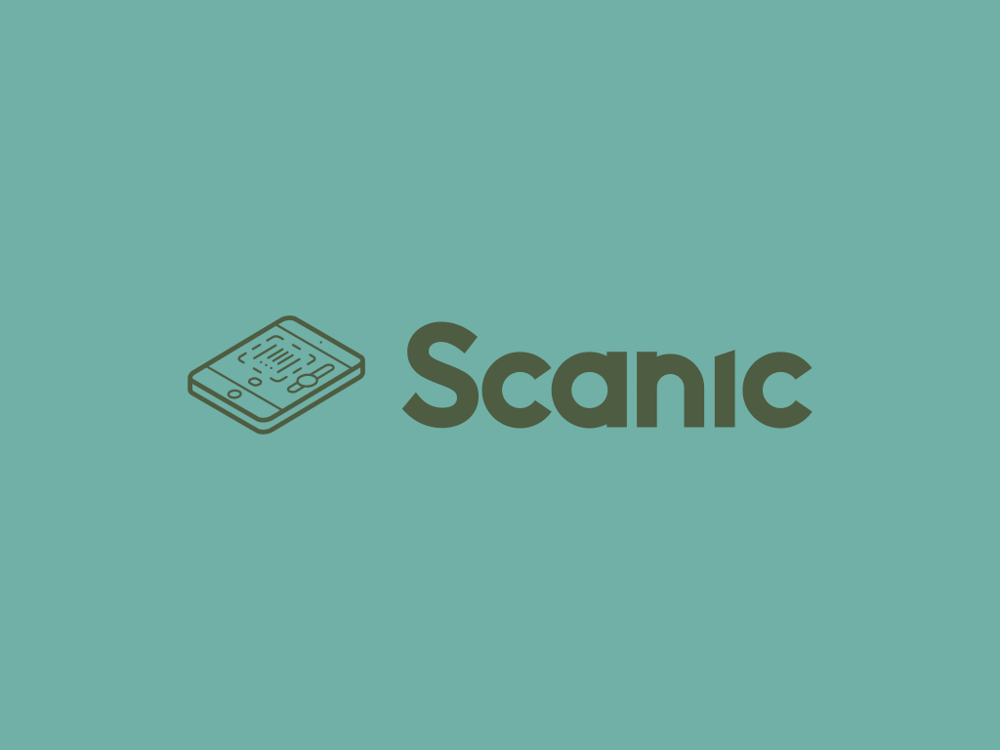

<p align="center">
  <a href="#">
    
  </a>
</p>

<p align="center">
    <a href="https://npmjs.com/package/scanic"></a>
    <br />
    <a href="https://github.com/marquaye/scanic/blob/main/LICENSE"></a>
    <a href="https://npmjs.com/package/scanic"></a>
    <a href="https://bundlephobia.com/package/scanic"></a>
    <a href="https://marquaye.github.io/scanic"></a>
</p>

# Scanic

**Ultra-fast, production-ready document scanning for the modern Web.**

Scanic is a high-performance document scanner library that brings professional-grade document edge detection and perspective correction to the browser and Node.js. By combining **Rust-powered WebAssembly** for pixel crunching and a **fast bilinear inverse-map warp** for image extraction, Scanic delivers near-native performance (~10ms transforms) with a tiny footprint.

[**Documentation**](https://marquaye.github.io/scanic) | [**Live Demo**](https://marquaye.github.io/scanic/demo/) | [**Framework Examples**](https://marquaye.github.io/scanic/guide/frameworks) | [**API Reference**](https://marquaye.github.io/scanic/api/reference)

---

## 🚀 Why Scanic?

Traditional web scanning solutions often force a trade-off:
- **OpenCV.js**: Powerful, but requires a massive **30MB+** download.
- **Pure JS**: Lightweight, but struggles with real-time performance and complex transforms.

**Scanic bridges this gap:**
- **Hybrid Engine**: Rust/WASM handles the CPU-heavy edge detection.
- **Turbo Warp**: A per-pixel bilinear inverse-map does perspective correction with no Canvas state-machine overhead or seam artifacts.
- **Zero Latency**: Designed for real-time applications like webcam scanning.

---

## ✨ Features

- 🎯 **Pinpoint Accuracy**: Robust document contour detection even in low-contrast environments.
- ⚡ **Turbocharged Warp**: Perspective transforms in **< 10ms** (vs 500ms+ in standard loops).
- 🦀 **WASM Core**: High-performance Gaussian Blur, Canny Edge Detection, and Dilation.
- 🛠️ **Modern API**: Clean, Promise-based API with full **TypeScript** support.
- 📦 **Featherweight**: Under **100KB** total size (gzipped).
- 🤖 **Optional ML detector**: switch to a neural corner detector for hard photos with `detector: 'ml'`. It is lazy loaded, needs no extra install, and uses a custom minimal ONNX Runtime build of about 1.5 MB instead of the usual 13 MB. See the [ML detection guide](https://marquaye.github.io/scanic/guide/ml-detection).
- 🧪 **Production Grade**: Built-in regression tests with physical image baselines.

## 🆕 What's New

See the [**full documentation**](https://marquaye.github.io/scanic), the
[**changelog**](CHANGELOG.md), and the [**releases**](https://github.com/marquaye/scanic/releases)
for the latest. Recent highlights:

- **Optional ML detector**: a neural corner detector (`detector: 'ml'`) for hard photos such as cluttered backgrounds, low contrast, or strong perspective. Lazy loaded and opt in. See the [ML detection guide](https://marquaye.github.io/scanic/guide/ml-detection).
- **Styleable corner editor**: a built-in, touch friendly UI to fine tune detected corners, now fully themeable via CSS variables with a polished default toolbar. See the [corner editor guide](https://marquaye.github.io/scanic/guide/corner-editor).
- **New docs site** with guides for Web/Node.js/Electron/React/Vue and an interactive in-browser playground.

---

## 🛠️ Installation

```bash
# via npm
npm install scanic

# via yarn
yarn add scanic
```

### CDN
```html
<script src="https://unpkg.com/scanic/dist/scanic.js"></script>
```

---

## 🎮 Demo

Try the interactive scanner in your browser:
👉 [**Open Scanic Live Demo**](https://marquaye.github.io/scanic/demo/)

---

## 📖 Usage

### Simple Usage
```js
import { scanDocument, extractDocument } from 'scanic';

// Simple usage - just detect document
const result = await scanDocument(imageElement);
if (result.success) {
  console.log('Document found at corners:', result.corners);
}

// Extract the document (with perspective correction)
const extracted = await scanDocument(imageElement, { mode: 'extract' });
if (extracted.success) {
  document.body.appendChild(extracted.output); // Display extracted document
}
```

### ML detection (optional)

On harder photos you can switch to a neural detector that is more robust. It is
opt in per call with `detector: 'ml'`, and it needs no extra install:

```bash
npm install scanic
```

```js
import { scanDocument } from 'scanic';

const result = await scanDocument(imageElement, { detector: 'ml' });
if (result.success) {
  console.log(result.corners);
  console.log(result.score); // P(document present), 0 to 1
}
```

The ONNX Runtime JavaScript API is bundled as a lazy chunk (about 50 KB, roughly
15 KB gzipped) that loads only when you use `detector: 'ml'`. On that first call
scanic fetches about 2 MB from a CDN (the companion
[`scanic-ml`](https://www.npmjs.com/package/scanic-ml) package): a 1.9 MB model
plus a custom minimal ONNX Runtime build of about 1.5 MB, which is roughly 88
percent smaller than the stock 13 MB runtime while running at the same speed. See
the [ML detection guide](https://marquaye.github.io/scanic/guide/ml-detection)
for options, self hosting, and threading.


### Manual corner adjustment UI

Use the built-in corner editor to let users drag corners on mobile and desktop,
then pass the confirmed corners into extraction.

```js
import { createCornerEditor, extractDocument } from 'scanic';

const editor = createCornerEditor({
  container: document.getElementById('editorHost'),
  image: imageElement,
  corners: detectedCorners, // optional: defaults to an inset quad
  magnifier: {
    zoom: 2,
    size: 110
  },
  nudges: {
    enabled: true,
    steps: [1, 5]
  },
  onConfirm: async (corners) => {
    const extracted = await extractDocument(imageElement, corners, { output: 'canvas' });
    document.getElementById('output').appendChild(extracted.output);
    editor.destroy();
  }
});
```

### Optimized Usage (Recommended for Batch/Real-time)
The `Scanner` class maintains a persistent WebAssembly instance, avoiding the overhead of re-initializing WASM for every scan.

```js
import { Scanner } from 'scanic';

const scanner = new Scanner();

// Initialize once (optional, scan() will initialize if needed)
await scanner.initialize();

// Scan multiple images efficiently
async function onFrame(img) {
  const result = await scanner.scan(img, { mode: 'extract' });
  if (result.success) {
    // Process result...
  }
}
```

## Examples

```js
const options = {
  mode: 'extract',
  maxProcessingDimension: 1000,  // Higher quality, slower processing
  lowThreshold: 50,              // More sensitive edge detection
  highThreshold: 150,
  dilationKernelSize: 5,         // Larger dilation kernel
  minArea: 2000,                 // Larger minimum document area
  debug: true                    // Enable debug information
};

const result = await scanDocument(imageElement, options);
```

### Different Modes and Output Formats

```js
// Just detect (no image processing)
const detection = await scanDocument(imageElement, { mode: 'detect' });

// Extract as canvas
const extracted = await scanDocument(imageElement, { 
  mode: 'extract',
  output: 'canvas' 
});

// Extract as ImageData
const rawData = await scanDocument(imageElement, { 
  mode: 'extract',
  output: 'imagedata' 
});

// Extract as DataURI
const rawData = await scanDocument(imageElement, { 
  mode: 'extract',
  output: 'dataurl' 
});

```


## 🛠️ Development

Clone the repository and set up the development environment:

```bash
git clone https://github.com/marquaye/scanic.git
cd scanic
npm install
```

Start the development server:

```bash
npm run dev
```

Build for production:

```bash
npm run build
```

The built files will be available in the `dist/` directory.

### Building the WebAssembly Module

The Rust WASM module is pre-compiled and included in the repository. If you need to rebuild it:

```bash
npm run build:wasm
```

This uses Docker to build the WASM module without requiring local Rust installation.

### Testing

Scanic uses Vitest for unit and regression testing. We test against real document images to ensure detection accuracy remains consistent.

```bash
npm test
```

The regression suite covers both the classical detector and the optional ML detector
(`src/baseline.test.js` and `src/baseline.ml.test.js`), each checked against its own
golden baseline in `testImages/`:

```bash
npm run baseline:check       # classical detector vs testImages/baseline-results.json
npm run baseline:check:ml    # ML detector vs testImages/baseline-results.ml.json

npm run baseline:update      # regenerate the classical baseline
npm run baseline:update:ml   # regenerate the ML baseline
```

The ML baseline test skips automatically when `onnxruntime-web` or the `scanic-ml`
model assets aren't available locally.


## 📊 Comparison

| Feature | Scanic | jscanify | OpenCV.js |
| :--- | :--- | :--- | :--- |
| **Download Size** | **~100KB** | ~31MB | ~30MB |
| **Perspective Speed** | **~10ms** | ~200ms | ~5ms |
| **WASM Optimized** | ✅ Yes | ❌ No | ✅ Yes |
| **GPU Acceleration** | ✅ Yes | ❌ No | ❌ No |
| **TypeScript** | ✅ Yes | ❌ No | ✅ Yes |


## 🤝 Contributing

Contributions are welcome! Whether it's reporting a bug, suggesting a feature, or submitting a pull request, your help is appreciated.

1. **Report Issues**: Use the GitHub Issue tracker.
2. **Pull Requests**:
   - Fork the repository.
   - Create a feature branch.
   - Commit your changes.
   - Open a Pull Request.

---

## 📜 Credits

- Inspired by [jscanify](https://github.com/puffinsoft/jscanify).
- WASM Blur module powered by Rust.
- The optional ML corner detector's architecture is [DocCornerNet](https://github.com/mapo80/DocCornerNet-CoordClass) (MIT licensed) by [mapo80](https://github.com/mapo80), based on [SimCC](https://arxiv.org/abs/2107.03332) (Li et al., ECCV 2022). See the [ML detection guide](https://marquaye.github.io/scanic/guide/ml-detection) for how it's trained, slimmed, and deployed in scanic.

---

## 💖 Sponsors

<p align="center">
  <strong>Special thanks to our amazing sponsors who make this project possible!</strong>
</p>

<div align="center">

### 🏆 Gold Sponsors

<table>
  <tr style="color: black;">
    <td align="center" width="300">
      <a href="https://zeugnisprofi.com" target="_blank"> 
        <br/>
        <strong>ZeugnisProfi</strong>
      </a>
      <br/>
      <em>Professional certificate and document services</em>
    </td>
    <td align="center" width="300">
      <a href="https://zeugnisprofi.de" target="_blank">
        <br/>
        <strong>ZeugnisProfi.de</strong>
      </a>
      <br/>
      <em>German document processing specialists</em>
    </td>
    <td align="center" width="250">
      <a href="https://www.verlingo.de" target="_blank">
        <br/>
        <strong>Verlingo</strong>
      </a>
      <br/>
      <em>Language and translation services</em>
    </td>
    <td align="center" width="250">
      <a href="https://mein-kreativbuch.de/" target="_blank">
        <br/>
        <strong>mein-kreativbuch.de</strong>
      </a>
      <br/>
       <em>Unique and personalized children's books</em>
    </td>
    <td align="center" width="250">
      <a href="https://ausschreibungszentrale.de/" target="_blank">
        <br/>
        <strong>ausschreibungszentrale.de</strong>
      </a>
      <br/>
       <em>Public tender matching platform</em>
    </td>
  </tr>
</table>

</div>

## 🗺️ Roadmap

See [**ROADMAP.md**](ROADMAP.md) for what's shipped and what's planned.

## License

MIT License © [marquaye](https://github.com/marquaye)

